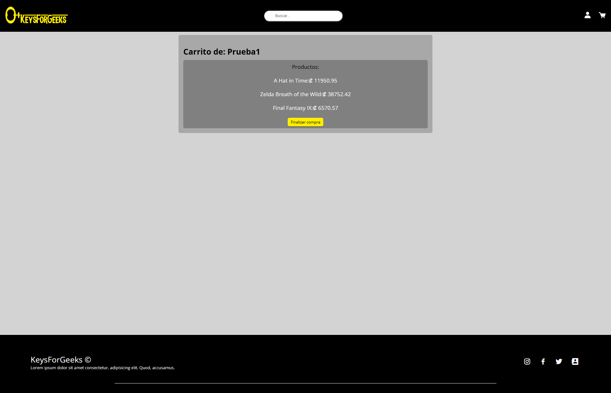
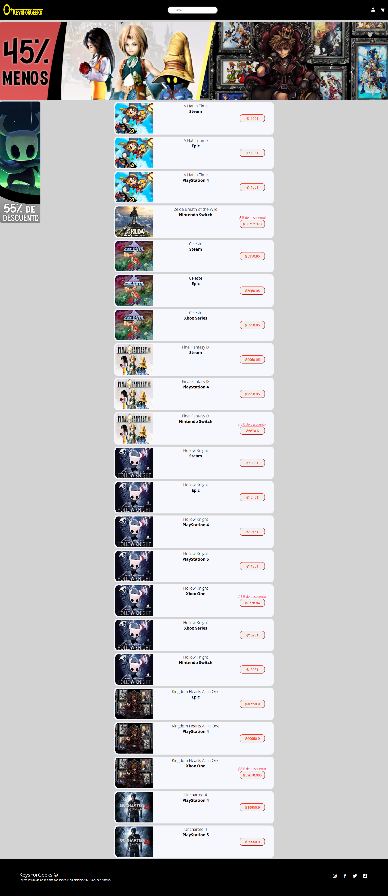
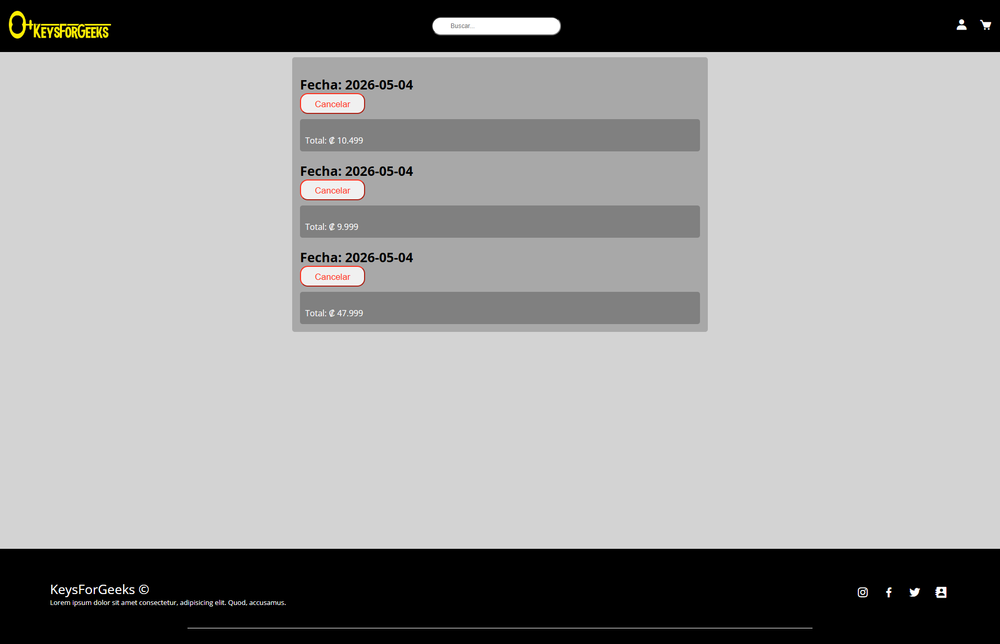
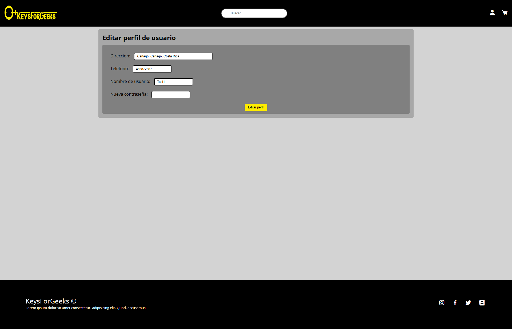
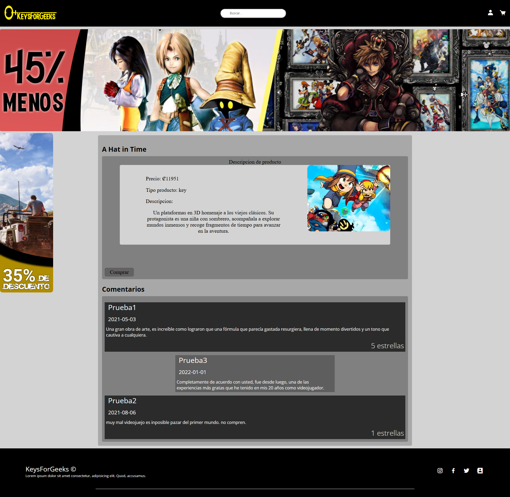
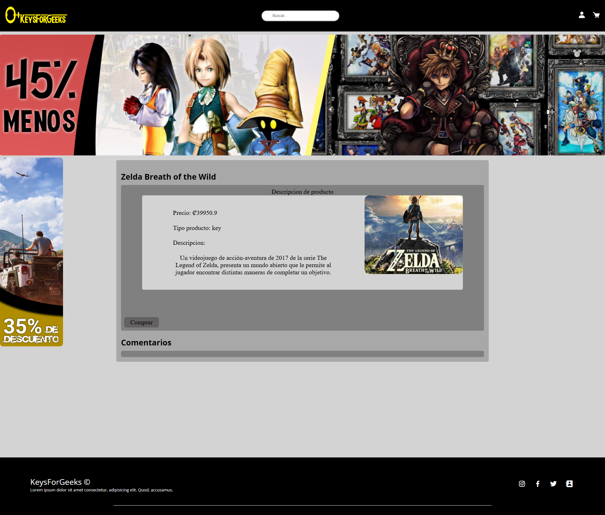

# Keysforgeeks E-commerce Platform (Legacy PHP System)


Keysforgeeks is a full-stack e-commerce web application built in PHP as an academic project (2022) and later revisited for documentation and portfolio purposes.

The system simulates a real digital marketplace for game keys, including user roles, shopping cart functionality, order management, discount handling, and external billing integration via SOAP services.

This project was developed under academic constraints where all frontend and backend logic was implemented using vanilla PHP, HTML, CSS, and minimal JavaScript.

## Features

### Authentication & Users

- User registration and login system
- Role-based access control (Admin / User)
- Profile management and updates

### E-commerce Flow

- Product catalog (game keys store simulation)
- Shopping cart functionality
- Purchase process and order creation
- Order cancellation system
- Purchase history per user

### Billing & Transactions

- Invoice generation system
- Integration with external SOAP-based billing service
- Transaction tracking and management

### Social Interaction

- Product comments system
- Reply to comments functionality

### Admin Features

- Product management (create, edit, delete)
- Discount management system
- Order and system administration tools

---

## Architecture

This project follows a **monolithic PHP architecture**, typical of academic web development projects before modern frameworks were introduced.

- Backend: PHP (procedural + includes)
- Frontend: HTML, CSS, JavaScript (vanilla)
- Database: MySQL
- External Services: SOAP (NuSOAP library)

---

## Database

The database scripts are located in: /BaseDeDatos

Files included:

- `CreacionDB.sql`: database schema
- `DatosPrueba.sql`: sample data

---

## Setup Instructions

### 1. Requirements

- XAMPP / WAMP / similar local server
- PHP 7.x+
- MySQL

### 2. Installation

1. Clone or copy the project into your local server directory: C:\xampp\htdocs\Keysforgeeks

2. Start Apache and MySQL in XAMPP

3. Create database: keysforgeeks_db

4. Import SQL file: /BaseDeDatos/CreacionDB.sql

(Optional) Import sample data: /BaseDeDatos/DatosPrueba.sql

5. Configure database connection:

File: /includes/Conexion.php

Ensure credentials match your local environment.

---

## External Billing Service (SOAP)

The project integrates with an external billing service using NuSOAP:

```php
$client = new nusoap_client("http://localhost/WSServer/registrar.php?wsdl");
```

This was used to simulate real-world invoice processing through a remote/independent system.

---

## Screenshots

### Login



### Product List



### Purchase History



### Edit User Profile



### Product Detail





---

## What I Learned

- Full-stack web development using PHP
- Role-based authentication systems (Admin / User)
- CRUD operations with MySQL
- Session management and user state handling in PHP
- Integration with external SOAP APIs (NuSOAP)
- Designing complete e-commerce workflows without frameworks
- Handling transactional flows (purchase → invoice → history)

---

## Known Limitations

- Monolithic architecture
- Mixed frontend and backend logic
- No modern frontend framework
- Legacy PHP structure typical of academic environments
- Limited scalability and separation of concerns

---

## Project Status

This project is no longer in active development.  
It has been preserved, refactored at a basic level, and documented for educational and portfolio purposes.

---

## Authors

Keylor Calderón, Elías Calderón and Gilberth Montoya

## Purpose

This repository serves as a demonstration of:

- End-to-end system design and implementation
- Ability to work with legacy codebases
- Full-stack PHP development fundamentals
- Database-driven application design
- Integration with external services (SOAP-based systems)
- Self-directed learning in a low-guidance academic environment
